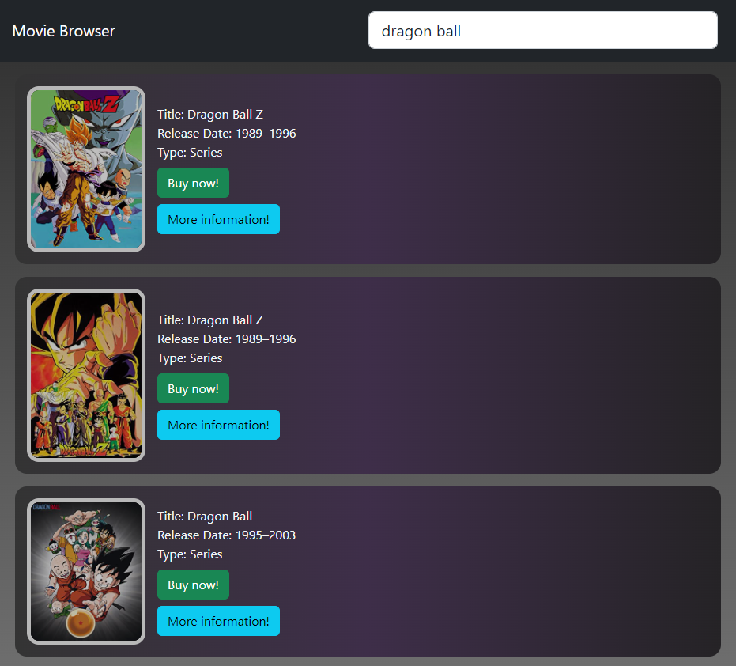
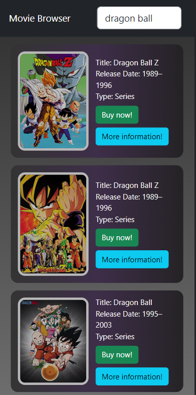

# Movie Browser

### Opis aplikacji

Aplikacja służąca do przeglądania bazy filmów, oparta o API https://www.omdbapi.com/, stworzona w **React.js**

Podstawową funkcjonalnością jest wyświetlanie danych pobranych z API - tytuł filmu, rok wydania, rodzaj produkcji oraz plakat.

Wyświetlenie informacji następuje automatycznie (wyszukiwanie 0,5 po zakończeniu wpisywania).

Pozostałe funkcjonalności to:
* przycisk **Buy now!** - przekierowanie do sklepu amazon
* przycisk **More information!** - przekierowanie do wikipedii

### Uruchamianie aplikacji

Aby uruchomić aplikację należy w wierszu poleceń (lokalizacja folderu *movie_browser*) wpisać ```npm start```

### Instalacja aplikacji

Jeśli plik został dopiero pobrany z repozytorium należy wcześniej wykonać polecenie
```npm install```
w lokalizacja folderu *movie_browser*.

### Prezentacja aplikacji

* Aplikacja w wersji PC



* Aplikacja w wersji mobilnej

